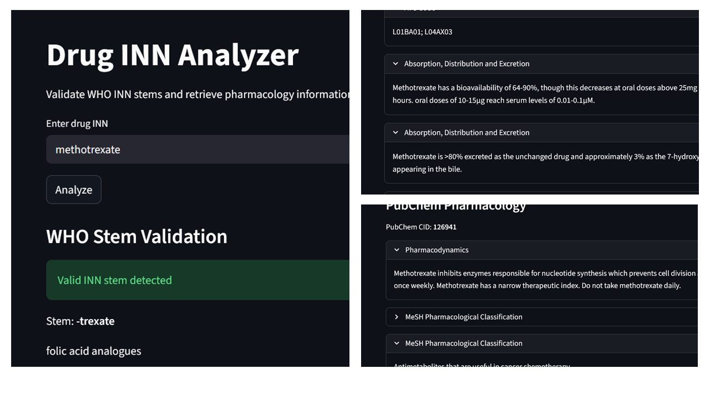

# Drug Information Search Using WHO Stems

A **Python web application** that analyzes drug **International Nonproprietary Names** (INN) using the stem classification system defined by the [World Health Organization](https://www.who.int/teams/health-product-and-policy-standards/inn) and retrieves pharmacological information from [PubChem](https://pubchem.ncbi.nlm.nih.gov/).

The application identifies pharmacological classes based on **WHO INN stems**, then **queries PubChem** to display detailed drug information through a **web interface built with Streamlit**.

## Overview

The International Nonproprietary Name (INN) system maintained by the World Health Organization assigns standardized names to pharmaceutical substances. Many of these names contain common stems that indicate the drug's pharmacological class.

This project uses those stems to:

1. Detect pharmacological classification from a drug's INN.
2. Retrieve additional molecular and pharmacological information from PubChem.
3. Present the results through a simple local web interface.

## How It Works

Given a drug's INN, the application performs the following steps:

1. **Stem Identification** : the drug name is analyzed and matched against WHO stem definitions stored in a local JSON database.
2. **Pharmacological Classification** : if a stem is detected, the corresponding pharmacological class is identified.
3. **PubChem Query** : the application queries the [PubChem REST API](https://pubchem.ncbi.nlm.nih.gov/docs/pug-rest) to retrieve chemical and pharmacological data.
4. **Data Visualization** : results are displayed through a Streamlit web interface running locally.

## Features

* WHO INN stem recognition
* Automatic pharmacological classification
* Integration with the PubChem REST API
* Interactive local web interface
* Lightweight JSON-based stem database

## Technologies Used

* Python 3.13.1
* Streamlit 1.55.0
* Requests 2.32.5
* JSON database
* PubChem REST API

## Data Sources

* [WHO List of Common Stems (2024)](https://www.who.int/publications/i/item/9789240099388)
Provided by the World Health Organization INN programme.

* [PubChem REST API](https://pubchem.ncbi.nlm.nih.gov/docs/pug-rest-tutorial)
Chemical and pharmacological data provided by National Center for Biotechnology Information.

## Installation and Usage

1️⃣ Install dependencies

```bash
pip install -r requirements.txt
```

2️⃣ Run the application

```bash
streamlit run app.py
```

## Demo


